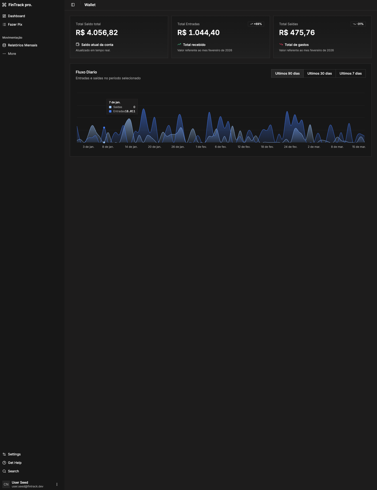
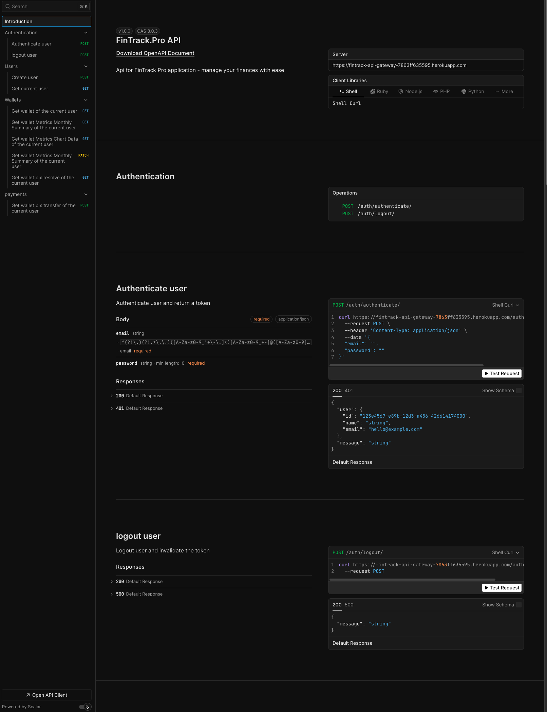
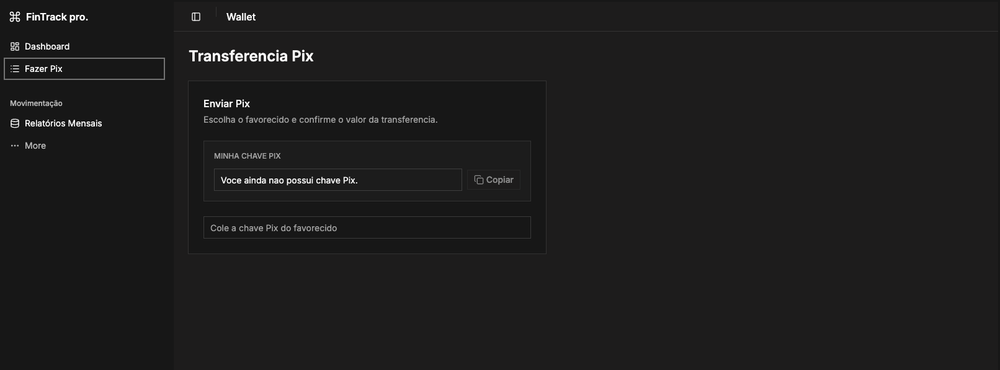

# FinTrack Pro

Monorepo de uma aplicacao financeira com frontend web, API Gateway, worker de transacoes e banco PostgreSQL.

## Proposta do projeto

FinTrack Pro e uma simulacao de arquitetura de fintech para gestao financeira pessoal, com foco em:

- Experiencia real de produto: autenticacao, carteira, Pix e metricas.
- Arquitetura escalavel: separacao entre gateway HTTP e processamento assíncrono.
- Comunicacao orientada a eventos com Kafka para fluxos de transferencia.
- Base pronta para evolucao de features sem acoplamento entre servicos.

## Preview

- Web (Vercel): https://seu-projeto.vercel.app
- API (Heroku): https://fintrack-api-gateway-7863ff635595.herokuapp.com
- Documentacao da API (Scalar): https://fintrack-api-gateway-7863ff635595.herokuapp.com/docs

## Screens

<p align="center">
  
  
</p>

<p align="center">
  
</p>

## O que foi implementado

- Autenticacao com JWT e cookie.
- Cadastro de usuario.
- Endpoint de perfil do usuario autenticado.
- Consulta de carteiras.
- Geracao e resolucao de chave Pix.
- Solicitacao de transferencia Pix.
- Metricas de carteira (resumo mensal e dados de grafico).
- Publicacao/consumo de eventos via Kafka para processamento de transferencia no worker.
- Documentacao interativa da API em `/docs`.

## Tecnologias usadas

### Frontend (apps/web)

- React 19
- Vite
- TypeScript
- TanStack Router
- TanStack Query
- TanStack Table
- Tailwind CSS v4
- shadcn/ui + Radix UI
- React Hook Form + Zod
- Axios
- Recharts

### Backend - API Gateway (apps/api-gateway)

- Node.js
- Fastify
- fastify-type-provider-zod
- @fastify/jwt
- @fastify/cookie
- @fastify/cors
- @fastify/swagger
- @scalar/fastify-api-reference
- KafkaJS
- bcrypt
- date-fns

### Worker de transacoes (apps/transaction-service)

- Node.js
- Fastify (runtime do servico)
- KafkaJS

### Banco e dados (packages/db)

- PostgreSQL
- Drizzle ORM
- Drizzle Kit
- postgres (driver)

### Pacotes compartilhados

- `@fintrack-pro/types`
- `@fintrack-pro/env` (dotenv + validacao com Zod)
- `@fintrack-pro/tsconfig`
- `@fintrack-pro/biome-config`

### Infra e DevOps

- Docker + Docker Compose (PostgreSQL, Zookeeper, Kafka, Kafka UI)
- Turborepo
- pnpm workspaces
- Biome
- GitHub Actions
- Heroku (backend)
- Vercel (frontend)

## Estrutura do monorepo

```text
apps/
  api-gateway/
  transaction-service/
  web/
packages/
  db/
  env/
  types/
  tsconfig/
  biome-config/
```

## Como rodar localmente

### Pre-requisitos

- Node.js 20+
- pnpm
- Docker e Docker Compose

### Passo a passo

```bash
pnpm install
docker-compose up -d
pnpm dev
```

No frontend, a variavel `VITE_API_URL` deve apontar para `/api`. Em desenvolvimento, o Vite faz proxy para `http://localhost:3333`; em producao, o rewrite do Vercel encaminha `/api/*` para o API Gateway.

Aplicacoes locais:

- Web: http://localhost:5173
- API Gateway: http://localhost:3333
- API Docs: http://localhost:3333/docs
- Kafka UI: http://localhost:8080

## Deploy e CI/CD existentes

- Workflow backend: `.github/workflows/deploy-backend-heroku.yml`
- Workflow frontend: `.github/workflows/deploy-web-vercel.yml`
- `vercel.json` com rewrite de `/api/*` para o API Gateway no Heroku


## 👨‍💻 Desenvolvedor

Este projeto foi idealizado e desenvolvido por **Jefferson Charlles*.

- **GitHub:** [@jeffersoncharlles](https://github.com/jeffersoncharlles)
- **Website:** [jeffersonc.dev](https://jefferdeveloper.com)
